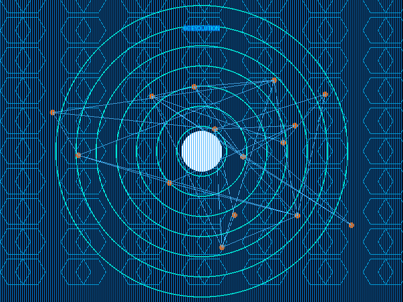

# AI_Agent

## 📋 نظرة عامة
هذا المشروع يحتوي على مجموعة من الملفات والكودات التي تم تطويرها وتعلمها. تم تحليل المجلد الحالي وتحديث هذا الملف آلياً ليعكس أحدث التطورات.

## 🎓 ما تم تعلمه (Learned Concepts)

### لغات البرمجة المستخدمة:
- CSS
- HTML
- JSON
- JavaScript
- Markdown
- Python
- Shell Scripting

### الأطر والمكتبات (Frameworks & Libraries):
- Flask

### المواضيع والتقنيات:
- APIs
- Databases
- Git
- Image Processing
- Maps/GIS

## 📂 هيكل المجلد الحالي

AI_Agent/

### ملفات الكود:

#### 📄 .intelligence_history.json
- **الحجم**: 132 بايت
- **عدد الأسطر**: 11

#### 📄 .tpa_protocol_state.json
- **الحجم**: 4204 بايت
- **عدد الأسطر**: 133

#### 📄 CONTRIBUTING.md
- **الحجم**: 563 بايت
- **عدد الأسطر**: 16
- **النوع**: ملف توثيق Markdown

#### 📄 EvolutionLog.txt
- **الحجم**: 66 بايت
- **عدد الأسطر**: 2

#### 📄 README.md
- **الحجم**: 7371 بايت
- **عدد الأسطر**: 175
- **النوع**: ملف توثيق Markdown

#### 📄 agent_bridge.py
- **الحجم**: 894 بايت
- **عدد الأسطر**: 29
- **النوع**: كود Python
- **الكلاسات**: AgentBridge
- **الدوال**: __init__, run_check

#### 📄 agent_knowledge.json
- **الحجم**: 2958 بايت
- **عدد الأسطر**: 86

#### 📄 app.py
- **الحجم**: 1361 بايت
- **عدد الأسطر**: 44
- **النوع**: كود Python
- **الدوال**: get_sys_info, index, background_thread, connect

#### 📄 banner.html
- **الحجم**: 274 بايت
- **عدد الأسطر**: 17
- **النوع**: ملف HTML

#### 📄 code_pulse_log.json
- **الحجم**: 157981 بايت

#### 📄 config.json
- **الحجم**: 174 بايت
- **عدد الأسطر**: 10

#### 📄 config.py
- **الحجم**: 85 بايت
- **عدد الأسطر**: 5
- **النوع**: كود Python

#### 📄 confirmation.txt
- **الحجم**: 141 بايت
- **عدد الأسطر**: 7

#### 📄 data.txt
- **الحجم**: 0 بايت
- **عدد الأسطر**: 1

#### 📄 development_scan_report.json
- **الحجم**: 532 بايت
- **عدد الأسطر**: 27

#### 📄 donut_memory.json
- **الحجم**: 1787 بايت
- **عدد الأسطر**: 58

#### 📄 file_manifest.txt
- **الحجم**: 2188 بايت
- **عدد الأسطر**: 72

#### 📄 full_inventory_report_20260425_115157.txt
- **الحجم**: 2110 بايت
- **عدد الأسطر**: 48

#### 📄 index.html
- **الحجم**: 8023 بايت
- **عدد الأسطر**: 178
- **النوع**: ملف HTML

#### 📄 intelligent_auto_exec.py
- **الحجم**: 1408 بايت
- **عدد الأسطر**: 58
- **النوع**: كود Python
- **الدوال**: auto_correct

#### 📄 main.py
- **الحجم**: 261 بايت
- **عدد الأسطر**: 15
- **النوع**: كود Python

#### 📄 memory.json
- **الحجم**: 391993 بايت

#### 📄 omni_agent.py
- **الحجم**: 4375 بايت
- **عدد الأسطر**: 105
- **النوع**: كود Python
- **الكلاسات**: OmniAgent
- **الدوال**: __init__, auto_discover_models, switch_model, ask_and_execute

#### 📄 processed_files.json
- **الحجم**: 652 بايت
- **عدد الأسطر**: 8

#### 📄 project_manifest.json
- **الحجم**: 90 بايت
- **عدد الأسطر**: 7

#### 📄 requirements.txt
- **الحجم**: 56 بايت
- **عدد الأسطر**: 2

#### 📄 revision_notes.txt
- **الحجم**: 128 بايت
- **عدد الأسطر**: 6

#### 📄 run.py
- **الحجم**: 929 بايت
- **عدد الأسطر**: 35
- **النوع**: كود Python
- **الدوال**: main

#### 📄 script.js
- **الحجم**: 1474 بايت
- **عدد الأسطر**: 34
- **النوع**: كود JavaScript

#### 📄 script.py
- **الحجم**: 24 بايت
- **عدد الأسطر**: 2
- **النوع**: كود Python

#### 📄 setup.py
- **الحجم**: 234 بايت
- **عدد الأسطر**: 11
- **النوع**: كود Python

#### 📄 setup_cli.sh
- **الحجم**: 174 بايت
- **عدد الأسطر**: 7

#### 📄 smart_ai.py
- **الحجم**: 2917 بايت
- **عدد الأسطر**: 64
- **النوع**: كود Python
- **الدوال**: similarity, get_response, main

#### 📄 sovereign_state.json
- **الحجم**: 1459 بايت
- **عدد الأسطر**: 53

#### 📄 style.css
- **الحجم**: 5401 بايت
- **عدد الأسطر**: 330

#### 📄 test.py
- **الحجم**: 14 بايت
- **عدد الأسطر**: 2
- **النوع**: كود Python

#### 📄 test_main.py
- **الحجم**: 201 بايت
- **عدد الأسطر**: 10
- **النوع**: كود Python
- **الكلاسات**: TestMain
- **الدوال**: test_main

#### 📄 tools.py
- **الحجم**: 60 بايت
- **عدد الأسطر**: 3
- **النوع**: كود Python

### ملفات أخرى:

- 📎 **.autonomous_scholar_mode** (7 بايت)
- 📎 **.env** (93 بايت)
- 📎 **.gitignore** (165 بايت)
- 📎 **6g_evolution.png** (38692 بايت)
- 📎 **LICENSE** (1076 بايت)
- 📎 **Makefile** (610 بايت)
- 📎 **evolution_step2.log** (319 بايت)
- 📎 **generated_image.png** (1952 بايت)
- 📎 **gitignore** (52 بايت)
- 📎 **global_linking.log** (424 بايت)
- 📎 **inventory.csv** (529 بايت)
- 📎 **model_change_event.log** (164 بايت)
- 📎 **self_evolution.log** (681 بايت)
- 📎 **social.db** (20480 بايت)
- 📎 **system_tool.log** (0 بايت)

## 🗺️ الخرائط والصور

### الصور:
- 🖼️ **6g_evolution.png** - 38692 بايت
  
- 🖼️ **generated_image.png** - 1952 بايت
  

## 🔄 التحديثات الأخيرة
- تم تحليل المجلد الحالي وتحديث هذا الملف آلياً
- إضافة وصف تفصيلي لجميع الملفات
- تحديد التقنيات والمفاهيم المستخدمة

## 🚀 كيفية الاستخدام
1. استعراض الملفات حسب نوعها
2. قراءة الكود المصدري لكل ملف
3. الرجوع لهذا الملف للحصول على نظرة شاملة

## 📝 ملاحظات
- تم إنشاء هذا الملف تلقائياً بواسطة سكريبت Python
- لإعادة تحديث الملف، قم بتشغيل السكريبت مرة أخرى
- تم تحليل الملفات بناءً على محتواها وامتداداتها

---
*تم التحديث في: 2026-04-27 16:15:42*
# Video Editor Pro - Professional Video Editing Tool

## طرق التشغيل

### التثبيت
bash
pip install -r requirements.txt

### التشغيل الأساسي
bash
python main.py

### تشغيل الواجهة الرسومية
bash
python gui.py

### تشغيل من سطر الأوامر
bash
python cli.py --input video.mp4 --output output.mp4 --effect fade

---

## طرق الربط

### الربط مع FFmpeg

from video_editor import FFmpegConnector

connector = FFmpegConnector()
connector.link_ffmpeg(path="/usr/local/bin/ffmpeg")

### الربط مع مكتبات Python

from video_editor import LibraryLinker

linker = LibraryLinker()
linker.link_library("opencv")
linker.link_library("moviepy")
linker.link_library("pillow")

### الربط مع APIs خارجية

from video_editor import APIConnector

api = APIConnector()
api.connect("youtube", api_key="your_api_key")
api.connect("dropbox", token="your_token")

---

## إنشاء فيديو احترافي

### إضافة مؤثرات احترافية

from video_editor import ProfessionalEffects

effects = ProfessionalEffects()
effects.add_transition("fade", duration=2)
effects.add_text_overlay("Title", position="center", font="Arial", size=48)
effects.add_color_correction(brightness=1.2, contrast=1.1)
effects.add_blur(percentage=20)
effects.add_chroma_key(green_screen=True)

### إنشاء فيديو كامل احترافي

from video_editor import ProfessionalVideoCreator

creator = ProfessionalVideoCreator()

# إضافة المقاطع
creator.add_clip("clip1.mp4", start=0, end=10)
creator.add_clip("clip2.mp4", start=5, end=15)

# إضافة المؤثرات
creator.add_effect("fade_in", duration=2)
creator.add_effect("fade_out", duration=2)
creator.add_effect("zoom", scale=1.5)

# إضافة الصوت
creator.add_audio("music.mp3", volume=0.5)
creator.add_voiceover("voice.wav", start=5)

# إضافة النصوص والعناوين
creator.add_title("فيديو احترافي", font_size=72, color="white")
creator.add_subtitle("النص هنا", position="bottom")

# إضافة الشعارات
creator.add_watermark("logo.png", position="top_right", opacity=0.8)

# تصحيح الألوان
creator.color_grade(preset="cinematic")
creator.add_vignette(intensity=0.3)

# التصدير بجودة عالية
creator.export("output.mp4", quality="4k", fps=60, bitrate="20M")

### جودة التصدير

# جودة 4K
creator.export("4k_video.mp4", resolution=(3840, 2160), fps=60)

# جودة HD
creator.export("hd_video.mp4", resolution=(1920, 1080), fps=30)

# جودة متحركة
creator.export("gif_output.gif", format="gif", fps=15)

---

## الأمثلة

### مثال كامل: إنشاء فيديو إحترافي

from video_editor import ProfessionalVideoCreator

creator = ProfessionalVideoCreator()

# تحميل المقاطع
creator.load_clips([
    "intro.mp4",
    "main_content.mp4",
    "outro.mp4"
])

# إضافة المؤثرات الاحترافية
creator.apply_professional_effects(
    transitions=True,
    color_grading="cinematic",
    stabilization=True,
    noise_reduction=True
)

# إضافة العناصر الاحترافية
creator.add_lower_third("العنوان", "الوصف")
creator.add_intro_animation()
creator.add_outro_animation()

# إنشاء الفيديو النهائي
creator.render("professional_video.mp4", preset="high_quality")

---

## المتطلبات
- Python 3.8+
- FFmpeg
- OpenCV
- MoviePy

## الدعم
للدعم الفني: support@videoeditorpro.com

---
## المساهمات
نرحب بمساهماتكم! يرجى إنشاء pull request للمراجعة.
