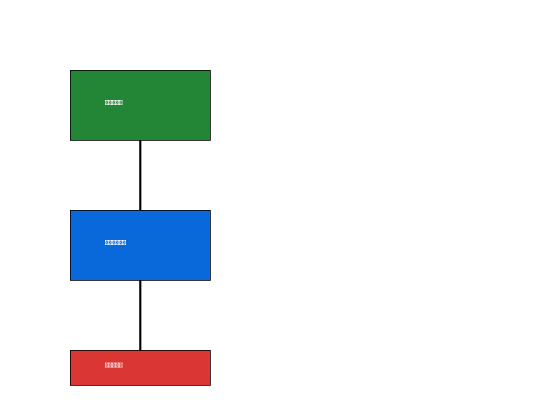

# اسم المشروع

## الوصف
وصف احترافي للمشروع مع شرح وظائفه وأهدافه.

## خريطة الميزات
mermaid
graph TD
    A[البداية] --> B[ميزة 1]
    A --> C[ميزة 2]
    B --> D[ميزة فرعية 1]
    B --> E[ميزة فرعية 2]
    C --> F[ميزة فرعية 3]
    C --> G[ميزة فرعية 4]

## لوحات التحكم (Dashboards)
- **لوحة تحليل البيانات**: [رابط]
- **لوحة الإحصائيات**: [رابط]

## الصور البرمجية

## التثبيت
### لينكس / ترمكس:
bash
git clone https://github.com/username/repo.git
cd repo
python3 run.py

### ويندوز:
bash
python run.py

## المساهمة
نرحب بالمساهمات! يرجى قراءة [دليل المساهمة](CONTRIBUTING.md).

## الرخصة
هذا المشروع مرخص تحت رخصة MIT - انظر ملف [LICENSE](LICENSE) للتفاصيل.
